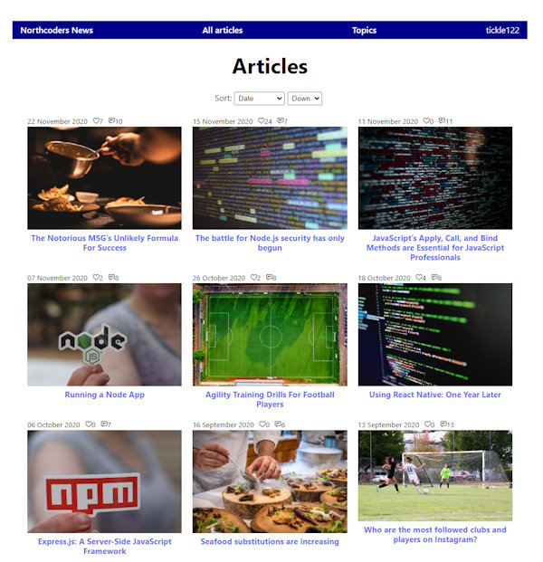

# Northcoders News Application

This is a demonstration web application that I wrote using the React library. The application reads, updates and writes data to/from a backend PostgreSQL database via a [REST API](https://github.com/marcusyoung/nc-news-api) (Node.js and Express) that I also developed. A live version of the application is deployed here: [https://nc-news-zmze.onrender.com](https://nc-news-zmze.onrender.com). 

## Features

### Sign up

A new user can sign up for an account. Credentials are stored in the database, with passwords hashed server side using the bcrypt.js package and incorporating a salt.

### Login

A user can login. The user’s credentials are sent to the backend server in the request body where the provided password is hashed and then compared with the hashed password stored in the database. On successful authentication a JSON Web Token is generated using a secret key and returned in the response body.  This token has a 24 hour expiration and is used for API endpoint authorisation. The token is added to the browser’s Local Storage.

### Profile page

Each user has a profile page. This page displays the user’s avatar, username, and display name.  The user can logout from their profile page. On logout, the JSON Web Token is remove form Local Storage.

### Header

From the header the user can select to view ‘All articles’ or the ‘Topics’ page. The right of the header shows the currently logged on user.

### Home page

The application home page displays a list of news articles, consisting of an image and article title. For each article, summary information is provided, included posting date, number of likes, and number of comments. The list of articles can be sorted by date (default), votes or comments. The sort order can be set to descending (default) or ascending.

### Article detail

The article detail page includes a title, image, summary information, and the text of the article. To the right of the article title is a badge indicating what topic the article relates to. 

#### Votes

Two heart icons are displayed below the article. One has a '+' symbol and the other a '-' symbol. The number of votes (negative or positive) an article has is shown next to the applicable symbol. A user can cast a negative or positive vote on the article by clicking the relevant icon. The vote is optimistically rendered, prior to the API call being made. This is to enhance the user experience. If the API call to register the vote fails, the user will be notified and the optimistically rendered change reversed.

#### Comments

Underneath the article any comments by users are shown. A logged-on user can add a comment. They can also delete any of their own comments. A new comment is added to state after successful posting via the API and displayed to the user at the top of the list of comments. The user will be notified if the comment fails to post.

### Topics

The topics page shows a list of available topics and a short description. The user can click on a topic to see a list of articles related to that topic.

## Running the project locally

- Requires Node.js (v21.6.0 or above)
- Clone this repository to your local machine using the URL [https://github.com/marcusyoung/nc-news.git](https://github.com/marcusyoung/nc-news.git)
- Run `npm -i` to install any dependencies.
- Run the app using: `npm run dev`

  
